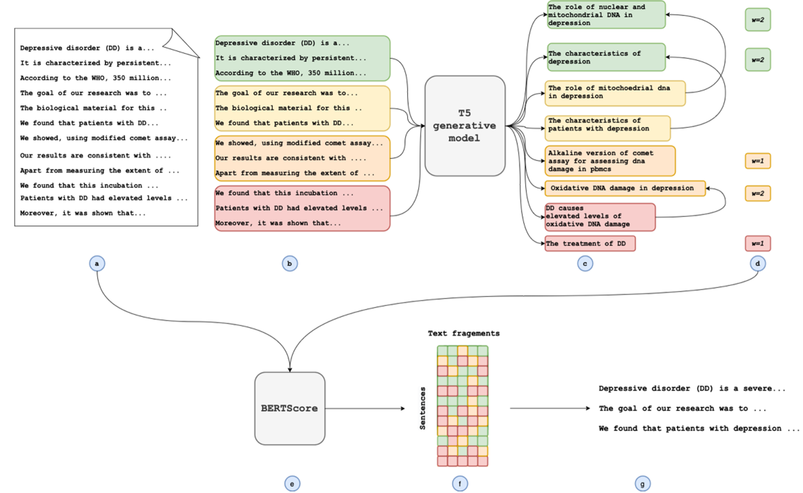

# GenCompareSum

This is the repository asssociated with the paper 'GenCompareSum: a hybrid unsupervised summarization method using salience'

The method is as follows: (a) We split the document into sentences. (b) We combine these sentences into sections of several sentences. (c) We feed each section into the generative text model and generate several text fragments per section. (d) We aggregate the questions, removing redundant questions by using n-gram blocking. Where aggregation occurs, we apply a count to represent the number of textual fragments which were combined and use this as a weighting going forwards. The highest weighted textual fragments are then selected to guide the summary.  (e) The similarity between each sentence from the source document and each selected textual fragment is calculated using BERTScore. (f) We create a similarity matrix from the scores calculated in the previous step. These are then summed over the textual fragments, weighted by the values calculated in step (d), to give a score per sentence. (g) The highest scoring sentences are selected to form the summary. 



# Data

### Sample data set

An example of how data should be formatted in included in the ./data/preprocessed_pubmed_sample.csv. `GenCompareSum.py` expects to be pointed to a csv file which contains:
* A column containing the article you want to summarize, split into sentences and saved in an array. 
* A column called 'summary_text_combined' which contains your target summary, which is used for the ROUGE calculated and compared with the generated summary. It is **important** to note that the summary should be split with `\n` characters between sentences. 

In our example data, we have columns `article_text`, which contains the full articles which have been split into sentences using the [StanfordNLP](https://stanfordnlp.github.io/CoreNLP/ssplit.html) software package, and a columns `short_article` which contains the same data, but truncated at the end of sentence which contains the 512th token. 

To prepare data sets used in the publication, follow [this README.md](./src/data_prep/README.MD)

# Set Up

This repo requires python>=3.7.
To install the dependencies for this repo:
```
pip install -r ./requirements.txt
```
To get pyrouge to work:
```
git clone https://github.com/andersjo/pyrouge.git ./src/rouge
pyrouge_set_rouge_path <PATH_TO_THIS_REPO>/src/rouge/tools/ROUGE-1.5.5
cd <PATH_TO_THIS_REPO>/src/rouge/tools/ROUGE-1.5.5/RELEASE-1.5.5/data/
rm WordNet-2.0.exc.db
./WordNet-2.0-Exceptions/buildExeptionDB.pl ./WordNet-2.0-Exceptions ./smart_common_words.txt ./WordNet-2.0.exc.db
```

Note that we adapt the original [BERTScore](https://github.com/Tiiiger/bert_score) code slightly, and include it within our repo under `src/bert_score`.

# Run GenCompareSum 

This code can be run on cpu or gpu, however, runs significantly slower on cpu. 
## To evaluate method with ROUGE metrics

```
python GenCompareSum.py --num_generated_texts 10 --block_n_gram_generated_texts 4 --col_name article_text --summary_len_metric sentences --num_sentences 9 --block_n_gram_sum 4   --visible_device 0 --texts_per_section 3 --temperature 0.5 --stride 4 --gen_text_weights 1 --data_path ./data/sample_preprocessed/pubmed.csv --generative_model_path doc2query/S2ORC-t5-base-v1  --similarity_model_name bert_score --similarity_model_path bert-base-uncased --inference_only False --save_predictions False
```

The generative models used in our paper were: 
* [docTTTTTquery](https://huggingface.co/castorini/doc2query-t5-base-msmarco)
* t5-med-query - We trained this model ourselves by flipping question, long-answer datasets around. A decription of the datasets and training parameters used to train this model can be found in Appendix B of [our paper](https://aclanthology.org/2022.bionlp-1.22.pdf).
* [t5-s2orc-title](https://huggingface.co/doc2query/S2ORC-t5-base-v1)

The config params are as follows:
* `--data_path` - Path to csv containing data to summarize
* `--similarity_model_path` - Either name of similarity model to take from [Hugging Face](https://huggingface.co), or local path to model
* `--generative_model_path` - Either name of T5-based generative model to take from [Hugging Face](https://huggingface.co), or local path to model
* `--similarity_model_name` - Type of similarity comparison model, either `bert_score`, `sentence_transformers` or `simcse`.
* `--col_name` - Name of the column which contains the text you want to summarize
* `--num_generated_texts` - Number of generated salient texts to select to carry forward to comparative step
* `--block_n_gram_generated_text` - If set, use an `Int` value to give the number of words which need to be the same consecutively between two texts for one of them to be removed. If unset, no n-gram blocking is applied to generated texts
* `--summary_len_metric` - Metric by which to get the target length of the summary, either `sentences` or `tokens`
* `--num_sentences` - Number of sentences to select for predicted extractive summary
* `--target_tokens` - Target number of tokens to aim for in predicted summary. 
* `--block_n_gram_sum` - If set, use an `Int` value to give the number of words which need to be the same consecutively between two texts for one of them to be removed. If unset, no n-gram blocking is applied to generated texts
* `--visible_device` - gpu device to use, if using a gpu
* `--gen_text_weights` -  Set to `1` if you would like to use the scores associated with generated texts to weight the similarity calculation
* `--temperature`- Temperature parameter of generative model
* `--texts_per_section` - Number of salient texts to generate per section
* `--stride` - Number of sentences to combine to make a section to feed into the generative model
* `--inference_only` - Does not run ROUGE calculations
* `--save_predictions` - Saves predictions into a `results.json` file

# Comparative methods for summarization

This folder contains code to run comparative methods which were reference in the paper GenCompareSum: a hybrid unsupervised summarization method using salience. 

1. [BERTExtSum](https://github.com/nlpyang/PreSumm) can be implemented directly. 
2. For ORACLE calculations, run:
```
python comparative_methods/oracle.py --data_csv  ./data/sample_preprocessed/pubmed.csv --col_name article_text --num_sentences 9
```
3. For other methods, run:
```
python ./comparative_methods/run_comparative_summary_method.py --data_csv  ./data/sample_preprocessed/pubmed.csv --col_name article_text --num_sentences 9 --method  <method>
```
`method` options include:
* `LEAD`
* `RANDOM`
* `LexRank`
* `TextRank`
* `SumBasic`

